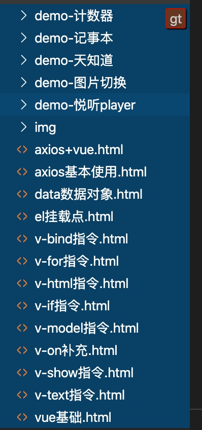

# vue_learning
## 概述

本项目是黑马程序员推出的线上课程，教学视频地址

https://www.bilibili.com/video/BV12J411m7MG?p=1

源码地址：https://pan.baidu.com/s/1EMT0XR72FqTx27Z-oH3g0A 密码: luag

文件目录：

## 课程内容

本课程共包含5个demo。分别为 

### 计数器

### 记事本

### 天知道

### 图片切换

### 悦听player

